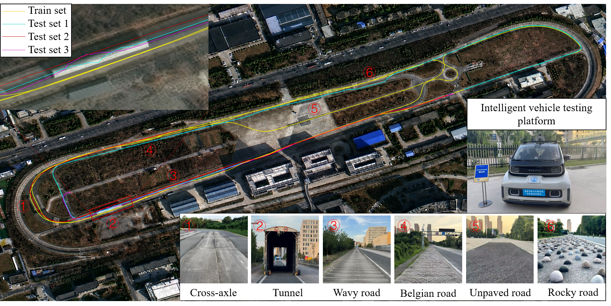

# CHU_260119

**A vehicle GNSS/IMU time-series dataset with annotated sensor anomalies.**

CHU_260119 contains a normal driving recording and three test recordings collected at the intelligent connected vehicle test site of Chang’an University. The recordings cover satellite-positioning disturbances and inertial disturbances in driving scenarios including tunnel passage and uneven road surfaces. The dataset supports time-series anomaly detection, identification of the affected sensor group, and observation-recovery research for vehicle localization.



Version **1.0.0** provides source sensor CSV files, annotations, a processed nine-channel representation at 200 Hz, and standalone loading and preprocessing scripts.

## Recordings

| Directory | Role | Frames at 200 Hz | GNSS anomaly frames | IMU anomaly frames | Anomaly fraction | GNSS / IMU events |
|---|---|---:|---:|---:|---:|---:|
| `train set` | Normal training recording | 148,371 | 0 | 0 | 0% | 0 / 0 |
| `test set 1` | Test: both anomaly types at different times | 63,549 | 5,300 | 23,270 | 45.0% | 1 / 4 |
| `test set 2` | Test: inertial disturbances | 32,700 | 0 | 12,827 | 39.2% | 0 / 6 |
| `test set 3` | Test: tunnel-related satellite disturbance | 25,441 | 4,200 | 0 | 16.5% | 1 / 0 |

The test recordings contain **121,690 frames and 12 anomalous events** in total. An event here is a maximal contiguous interval of one nonzero source label after preprocessing. The annotation set has no simultaneous GNSS-and-IMU source labels.

## Download

Open this repository's **Releases** page and select **v1.0.0**.

| Asset | Contents |
|---|---|
| `CHU_260119_raw_v1.0.0.zip` | The selected source sensor CSV files and annotation files |
| `CHU_260119_processed_v1.0.0.zip` | Ready-to-load nine-channel recordings, timestamps, positions, masks and labels |

Extract the desired data archive into the repository root. Each archive already contains its `data/raw/` or `data/processed/` directory. 

```text
CHU_260119/
  README.md
  requirements.txt
  DATASET_METADATA.json
  docs/
    DATA_FORMAT.md
    preprocessing.json
    statistics.json
    raw_files.json
  scripts/
    load_example.py
    prepare.py
    verify_dataset.py
  examples/
    test1_first256.csv
  data/                         # created by extracting data assets
    raw/
    processed/
```

## Quick start

Use Python **3.11 or newer**. The helper scripts require only NumPy and pandas; a GPU is not required.

```bash
python -m pip install -r requirements.txt
python scripts/load_example.py --data-dir data/processed --subset "test set 1"
python scripts/verify_dataset.py --data-dir data
```

To load arrays directly:

```python
from pathlib import Path
import numpy as np
import pandas as pd

folder = Path("data/processed/test set 1")
x = pd.read_csv(folder / "features.csv").to_numpy(dtype=np.float64)
t = np.load(folder / "timestamps.npy", allow_pickle=False)
source = np.load(folder / "source_labels.npy", allow_pickle=False)
mask = np.load(folder / "anomaly_mask.npy", allow_pickle=False)
# x: (63549, 9); source: (63549,); mask: (63549, 9)
```

## Channels and labels

| Columns | Meaning | Unit |
|---|---|---|
| `dE, dN, dU` | Successive position increments in local East, North, Up coordinates | m |
| `ax, ay, az` | Recorded IMU acceleration components | m/s² |
| `gx, gy, gz` | Recorded IMU angular-velocity components | rad/s |

The column order is fixed: **`dE, dN, dU, ax, ay, az, gx, gy, gz`**. Values are supplied in physical units without normalization. The position increment at the first frame is zero.

- `binary_labels.npy`: `0` = normal; `1` = annotated anomalous.
- `source_labels.npy`: `0` = normal; `1` = GNSS group; `2` = IMU group.
- `anomaly_mask.npy`: shape `(N, 9)`, with `1` marking an annotated anomalous channel. This is **not** an observed-value/keep mask; an imputation implementation that uses `1 = keep` must invert it.
- `events.csv`: contiguous source events with zero-based, half-open frame intervals `[start_index, end_index_exclusive)`.

The zero labels supplied for `train set` represent its role as the normal training recording. Test annotations are evaluation information, not input features. Physical sensor failure mechanisms are not independently established by a GNSS/IMU source label.

## Rebuild the processed data

After extracting the raw archive:

```bash
python scripts/prepare.py --raw-dir data/raw --out-dir data/rebuilt
python scripts/verify_dataset.py --data-dir data --compare data/rebuilt
```

The release profile reproduces the distributed features, timestamps, positions and masks. It preserves the preprocessing used for each recording:

- Align the approximately 400 Hz RTK-position observations to the IMU timeline by nearest timestamp, within 5 ms.
- Reduce IMU channels by averaging each pair of samples.
- For `train set`, reduce ENU positions and timestamps by pairwise averaging. For `test set 1`, `test set 2` and `test set 3`, retain the first position and timestamp in each pair.
- Difference the reduced positions to obtain `dE, dN, dU`.
- For test annotations, combine the RTK coordinate masks by logical OR, replicate this label across the three position channels, and reduce channel masks by pairwise OR. Derive binary and source labels from the resulting nine-channel mask.

The separate 4 Hz receiver GNSS files are included in the raw archive but do not generate the nine-channel representation. Coordinate reference origins are recording-specific and recorded in metadata. See [Data format and preprocessing](docs/DATA_FORMAT.md) for details.

## Evaluation scope

Use the normal recording to fit model parameters and normalization statistics. If a validation split is needed, define and report it within the normal recording; splitting before extracting overlapping windows avoids sharing observations across training and validation. Test labels should be reserved for evaluation.

The high-rate RTK-position stream is part of the observed data and is itself disturbed in annotated GNSS intervals. **It is not independent clean position ground truth within those intervals.** `positions_enu.npy` contains positions derived from that same stream. Endpoint continuity and motion smoothness may support recovery assessment, but they do not establish absolute position accuracy inside an anomaly. Oracle-mask recovery and recovery driven by detector predictions are different evaluation settings and should be reported separately.

These recordings cover one collection site and a limited set of events. Performance on the annotated source classes does not establish coverage of simultaneous sensor faults or generalization to other vehicles and environments.

## Integrity and versioning

Each data archive contains an internal `SHA256SUMS` file. The verification script checks checksums, dimensions, timestamp order, labels, event intervals and consistency between position increments and ENU positions. Published data revisions should use a new version and retain their associated checksums. The helper scripts were verified with Python 3.12, NumPy 2.3.5 and pandas 3.0.1.

## Author and contact

- Author: Shixiang Chen
- Affiliation: Chang’an University
- Email: [chenshixiang@chd.edu.cn](mailto:chenshixiang@chd.edu.cn)


Author and contact information are also provided in [DATASET_METADATA.json](DATASET_METADATA.json), included in both data archives.

## License and citation

No license is currently specified for either the dataset or the helper scripts. A formal citation for the accompanying paper is not yet available.
